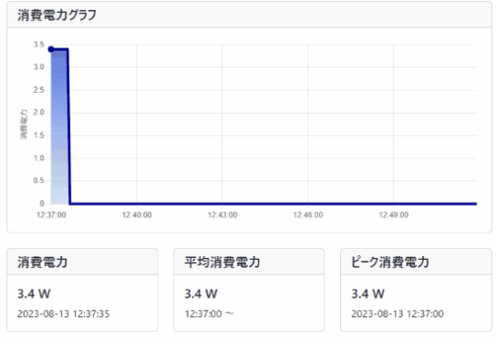
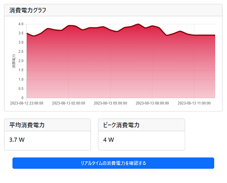

# プラグミニで作るワットチェッカー

SwitchBotプラグミニとRaspberyPi Pico Wを使って、消費電力を見るワットチェッカーを作成しました。

## 必要なもの

- Raspberry Pi Pico W
    - MicroPython使用
- SwitchBotプラグミニ (JP)
    - Wi-FiとBluetooth対応
- PCなど
    - ソースコードを注入するのに使用
    - Pico Wが動作しているIPアドレス確認にも使用

## セットアップ

### MicroPythonの準備

PC(Windows)に、Raspberry Pi Pico Wを接続して、MicroPythonが使用可能な状態にセットアップします。
今回使用したファームはBluetoothが使用可能な `micropython-firmware-pico-w-130623.uf2` を使用しました。


### 環境設定

sourcesフォルダに各ファイルを作成して、それぞれの環境情報を記述します。

#### laninfo.txt

laninfo.txtはRaspberryPi Pico Wが接続するWi-Fiの情報を記載します。
1行目に接続先のSSID、2行目にパスワードを記載します。それ以外情報は記述しないようにしてください。

```laninfo.txt
(SSID)
(PASSWORD)
```

#### plugmini.txt

plugmini.txtは情報収集に使用するSwitchBotプラグミニのBluetoohのアドレス情報を記載します。
以下のように：区切りでアドレスを記載します。
このアドレス情報は、SwitchBotのスマホアプリから確認することが可能です。

```plugmini.txt
# SmartBotプラグミニのアドレスを記述
11:22:33:44:55:66
```

### 転送＆実行

本リポジトリのsources以下のファイルをRaspberryPi Pico Wに転送します。
Thonny アプリを使用して、このフォルダを開き、ファイルを選択して転送してしまうのが楽です。

転送後、main.py ファイルを開いて、F5で実行するとシェルの領域にIPアドレスの情報が出力されるので、ここをブラウザでアクセスします。

## 使い方/マニュアル

出力されたIPアドレスに、ブラウザでアクセスします。
次のようなWebページが表示され、リアルタイムの消費電力グラフを見ることができます。



また、30分単位で記録された過去の推移についても別ページで確認することが可能です。



## 注意事項

本ソフトウェアは自由に使用可能ですが、何の保証もありません。
試される場合には、自己責任でご利用ください。

